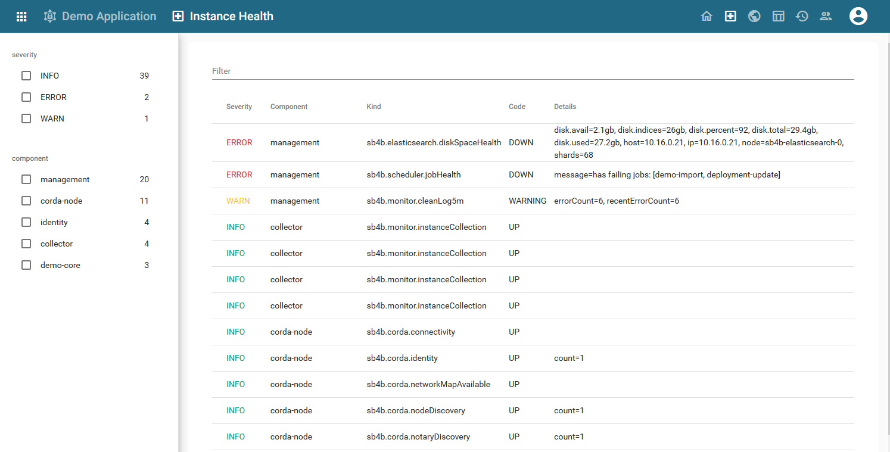

:sectnums:

# Crnk Documentation
:toc: left
:toclevels: 2

Crnk is a native resource-oriented rest library where resources, their relationships and repositories are the main building
blocks. In that regard Crnk differ quite dramatically from most REST library out there and opens up many new possibilities.
It allows you to rapidly build REST APIs without having to worry about lower protocol details and lets you instead
focus on what matters: your application.

The <<architecture>> chapter goes into  more details about the merits of resource-oriented APIs, how design
cleaner and more consistent APIs that are easier to understand and better to maintain and evolve with a changing future.

Crnk come with support for:

- popular frameworks like Spring Boot, JEE, Vert.x.
- reactive and classical/blocking programming model.
- standardized url handling: e.g. `/api/persons?filter[title]=John` and `/api/persons/{id}`
- sorting, filtering, pagination.
- attaching link and meta information to resources.
- inserting, updating and deleting of resources.
- support to request complex object graphs in a single request with JSON:API inclusions.
- support for partial objects with sparse field sets.
- atomically create, update and delete multiple with http://jsonpatch.com/[jsonpatch.com].
- a flexible module API to choose and extend the feature set of Crnk.
- eased testing with the client implementation providing type-safe stubs to access server repositories.
- repositories providing runtime/meta information about Crnk to implement, for example, documentation
  and UI automation.
- generation of type-safe client stubs (currently Typescript as target language implemented)
- filters and decorates to intercept and modify all aspects of an application and Crnk.

This allows to rapidly build advanced screens like:

By default Crnk follows the JSON:API specification and recommendations. But there is also a similar,
more <<format_plain,basic endpoint>> targeting simpler applications.

Crnk is small, modular and lightweight. It integrates well with many popular frameworks and APIs
and scale to anything from micro-services to serverless systems:

- CDI: resolve repositories and extensions with CDI.
- Spring: run Crnk with Spring, including support for Spring Boot, ORM, Security and Sleuth.
- Reactor: for support of reactive programming.
- Servlet API: run Crnk as servlet.
- JAXRS: run Crnk as feature.
- JPA: expose entities as JSON:API resources.
- JSR-303 bean validation: properly marshal validation and constraints exceptions.
- OpenTracing: trace all your calls.

While Crnk follows the JSON:API specification, it is not limited to that. Have a look at the
http://www.crnk.io/[roadmap] for more information.

:leveloffset: 1

include::examples.adoc[]
include::architecture.adoc[]
include::setup.adoc[]
include::resource.adoc[]
include::repositories.adoc[]
include::client.adoc[]
include::format.adoc[]
include::reactive.adoc[]
include::security.adoc[]
include::dataaccess.adoc[]
include::generation.adoc[]
include::operations.adoc[]
include::monitoring.adoc[]
include::faq.adoc[]
include::module_development.adoc[]

:leveloffset: 0