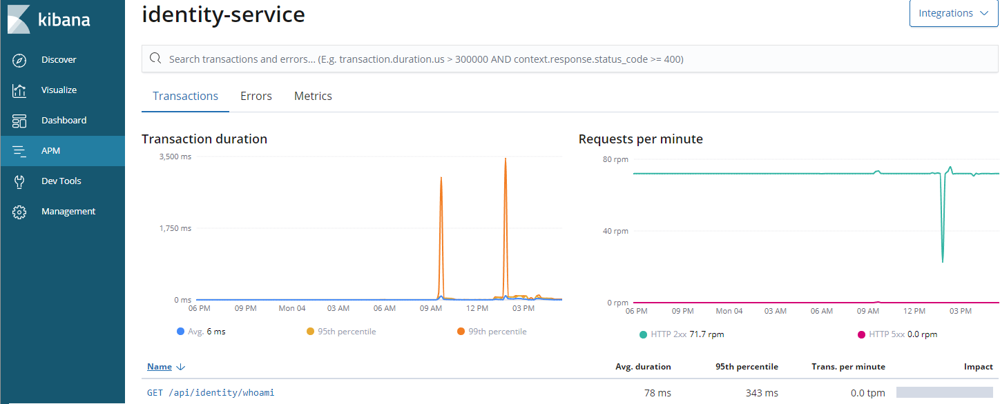

anchor:monitoring[]

# Monitoring

anchor:brave_module[]

## OpenTracing

https://opentracing.io/[OpenTracing] is a open, vendor-neutral API for tracing similar to SLF4J for logging.
The project is a member of the https://www.cncf.io/[Cloud Native Foundation]. https://www.jaegertracing.io/[Jeager] and
https://www.elastic.co/solutions/apm[Elastic APM] are two implementation providing support for it.
`crnk-monitor-opentracing` features an `OpenTracingServerModule`. The module sets a
human-readable name to any span tracing a JSON:API call, for example:

- `GET /api/users`
- `PATCH /api/users/{id}`

Notice the `{id}` that will prevent dynamic parts of the URL from polluting the tracing data stores.

INFORMATION:  The module does not start spans on its own. It is the duty of the underlying HTTP layer
  to do so. This way the HTTP layer can cover all kinds of calls, not just JSON_API ones.

In Kibana together with Elastic APM it looks like:

WARNING: Distributed tracing  is  still an evolving topic. Most notably
 https://www.w3.org/community/trace-context/[W3C Trace Context] will provide a standard for
 header propagation that hopefully will allow various systems to better work together on a
 protocol-level.

## Tracing with Zipkin/Brave

WARNING: This module is deprecated. The use of OpenTracing is recommended instead.

A `BraveClientModule` and `BraveServletModule` provided by `io.crnk:crnk-monitor-brave4` provides
integration into Zipkin/Brave to implement tracing for your repositories.  The module is applicable to
both a Crnk client or server.

The Crnk client can make use of either HttpClient or OkHttp to issue HTTP requests.
Accordingly, a matching brave integration must be added to the classpath:

* `io.zipkin.brave:brave-instrumentation-okhttp3`
* `io.zipkin.brave:brave-instrumentation-httpclient`

The `BraveClientModule` then takes care of the integration and will create a client span
for each request.

On the server-side, `BraveServletModule` creates a local span for each accessed repository.
Every request triggers one or more repository accesses (depending on whether
relations are included). Note however that `BraveServletModule` does not setup tracing
for incoming requests. That is the purpose of the JAX-RS/servlet integration of Brave.

Have a look at the Spring boot example application to see the `BraveServletModule` in use
together with a log reporter writing the output to console.

NOTE: `io.crnk:crnk-brave` is deprecated and makes use of the Brave 3.x API.

