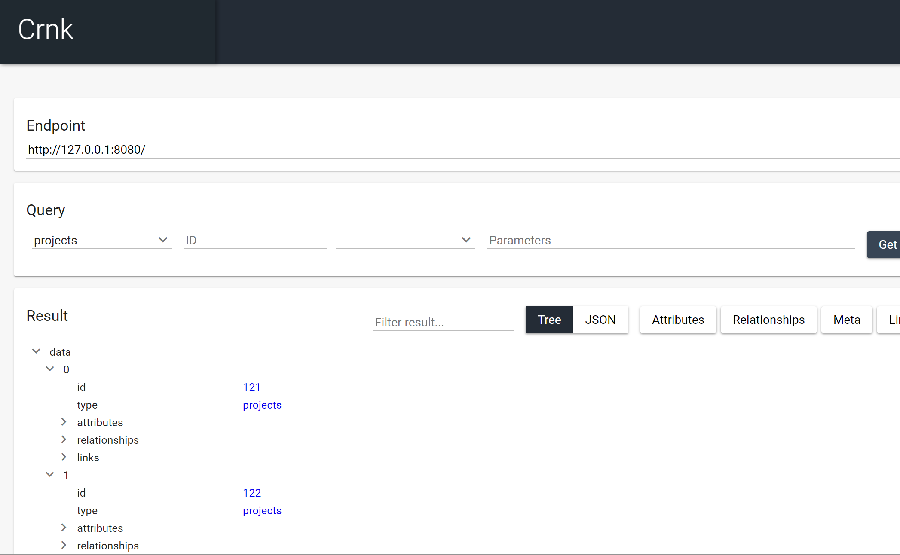

anchor:setup[]

# Setup

Crnk integrates well with many popular frameworks. The example applications outline various different possible
setups. But application are also free to customize their setup to their liking.
There are three main, orthogonal aspects of Crnk that need configuration:

1. The integration into a web framework like JAXRS or the Servlet API to be able to process requests.
2. The discovery of repositories, modules, exception mappers, etc. Usually by a dependency injection framework. But can also
   happen manually.
3. The selection of third-party modules to reuse. For a list of modules provided by Crnk see the <modules> chapter.

The subsequent sections explain various possibilities resp. how to implement a custom one.
The <<reactive>> chapter further outlines how to setup Crnk in an asynchronous/reactive setting.


## Requirements

Crnk library requires minimum Java 8 (as of Crnk 2.4) to build and run. In the future it will come with support
for both the current major Java releases (9, 10, 11, etc.) and the current long-term support version that gets
released every three years.

## Repository

Crnk Maven artifacts are available from Bintray/JCenter.

https://bintray.com/crnk-project

In Gradle it looks like:

```
repositories {
   jcenter()
}
```

Note that due to performance/reliability issues, releases are only intermittently pushed to Maven Central.
It is highly recommended for project to go with JCenter as well.

Stable releases hosted on Bintray/JCenter are also available from:

https://bintray.com/crnk-project/maven
https://dl.bintray.com/crnk-project/maven/

Most recent builds are available from (for a limited period of time):

https://bintray.com/crnk-project/mavenLatest
https://dl.bintray.com/crnk-project/mavenLatest/


## BOM

With `io.crnk:crnk-bom` a Maven BOM is provided that manages the dependencies of all crnk artifacts.
In Gradle the setup then looks as follows:

[source]
----
buildscript {
	dependencies {
		classpath "io.spring.gradle:dependency-management-plugin:1.0.4.RELEASE"
	}
}

gradle.beforeProject { Project project ->
	project.with {
		apply plugin: 'io.spring.dependency-management'
		dependencyManagement {
			imports {
				mavenBom "io.crnk:crnk-bom:$CRNK_VERSION"
			}
		}
	}
}
----

The crnk modules can then simply be used without having to specify a version:

[source]
----
dependencies {
	compile 'io.crnk:crnk-rs'
	compile 'io.crnk:crnk-setup-spring-boot2'
	...
}
----

## Logging

Crnk makes use of SLF4J to do logging. Make sure to have the API properly setup. For example by making use of Logback or one of the many bridges to
other Logging frameworks.

TIP: Set `io.crnk` to `DEBUG` if you encounter any issues during setup or later at runtime.


## Integration with JAX-RS

Crnk allows integration with JAX-RS environments through the usage of JAX-RS specification. JAX-RS 2.0 is
required for this integration. Under the hood there is a @PreMatching filter which checks each request for
JSON:API processing. The setup can look as simple as:

### CrnkFeature

[source]
----
@ApplicationPath("/")
	public class MyApplication extends Application {

		@Override
		public Set<Object> getSingletons() {
			CrnkFeature crnkFeature = new CrnkFeature();
			return Collections.singleton((Object)crnkFeature);
		}
	}
----

`CrnkFeature` provides various accessors to customize the behavior of Crnk.
A more advanced setup may look like:

[source]
----
	public class MyAdvancedCrnkFeature implements Feature {

		@Inject
		private EntityManager em;

		@Inject
		private EntityManagerFactory emFactory;

		...

		@Override
		public boolean configure(FeatureContext featureContext) {
			// also map entities to JSON:API resources (see further below)
			JpaModule jpaModule = new JpaModule(emFactory, em, transactionRunner);
			jpaModule.setRepositoryFactory(new ValidatedJpaRepositoryFactory());

			// limit all incoming requests to 20 resources if not specified otherwise
			DefaultQuerySpecUrlMapper urlMapper = new DefaultQuerySpecUrlMapper();
			urlMapper.setDefaultLimit(20L);

			ServiceLocator serviceLocator = ...
			CrnkFeature feature = new CrnkFeature();
			feature.addModule(jpaModule);
			feature.getBoot().setUrlMapper(urlMapper);

			featureContext.register(feature);
			return true;
		}
	}
----

Crnk will install a JAX-RS filter that will intercept and process any Crnk-related request.

Note that depending on the discovery mechanism in use (like Spring or CDI), modules like this JpaModule can be picked
up automatically and do not manual registration.

### Exception mapping for JAX-RS services

In many cases Crnk repositories are used along regular JAX-RS services. In such scenarios it can be worthwhile
if Crnk repositories and JAX-RS services make use of the same exception handling and response format. To make
use of the JSON:API resp. Crnk exception handling in JAX-RS services, one can add the
*ExceptionMapperBridge* to the JAX-RS application. The constructor of `ExceptionMapperBridge`
takes `CrnkFeature` as parameter.

For an example have a look at the next section which make use of it together with `JsonApiResponseFilter`.


### Use JSON:API format with JAX-RS services

Similar to `ExceptionMapperBridge` in the previous section, it is possible for JAX-RS services to return
resources in JSON:API format with *JsonApiResponseFilter*. `JsonApiResponseFilter` wraps primitive
responses with a `data` object; resource objects with `data` and `included` objects.
The constructor of `JsonApiResponseFilter` takes `CrnkFeature` as parameter.


To determine which JAX-RS services should be wrapped, `JsonApiResponseFilter` checks whether the
`@Produce` annotation delivers JSON:API. The produce
annotation can be added, for example, to the class:

[source]
.ScheduleRepository.java
----
include::../../../../crnk-test/src/main/java/io/crnk/test/mock/repository/ScheduleRepository.java[tags=annotation]
----

And the JAX-RS application setup looks like:

[source]
.JsonApiResponseFilterTestBase.java
----
include::../../../../crnk-setup/crnk-setup-rs/src/test/java/io/crnk/rs/JsonApiResponseFilterTestBase.java[tags=docs]
----

Note that  `CrnkProperties.NULL_DATA_RESPONSE_ENABLED` determines whether null responses should be wrapped
as JSON:API responses.


### JAX-RS service interoperability

It is possible to implement repositories that host both JAX-RS and JSON-API methods to complement JSON
API repositories with non-resource based services. Have a look at the <<client_jaxrs,Crnk Client chapter>> for an example.


## Integration with Servlet API

There are two ways of integrating crnk using Servlets:

* Adding an instance of ``CrnkServlet``
* Adding an instance of ``CrnkFilter``

### Integrating using a Servlet

There is a `CrnkServlet` implementation allowing to integrate Crnk into a Servlet environment.
It can be configured with all the parameters outlined in the subsequent sections. Many times
application will desire to do more advanced customizations, in this case one can
extends `CrnkServlet` and get access to `CrnkBoot`. The code below shows a sample implementation:

[source]
.SampleCrnkServlet.java
----
include::../../../../crnk-setup/crnk-setup-servlet/src/test/java/io/crnk/servlet/SampleCrnkServlet.java[tags=docs]
----

The newly created servlet must be added to the ``web.xml`` file or to another deployment descriptor.
The code below shows a sample ``web.xml`` file with a properly defined and configured servlet:

[source]
----
  <web-app>
    <servlet>
      <servlet-name>SampleCrnkServlet</servlet-name>
      <servlet-class>io.crnk.servlet.SampleCrnkServlet</servlet-class>
      <init-param>
        <!-- can typically be ommitted and is auto-detected -->
        <param-name>crnk.config.core.resource.domain</param-name>
        <param-value>http://www.mydomain.com</param-value>
      </init-param>
    </servlet>
    <servlet-mapping>
      <servlet-name>SampleCrnkServlet</servlet-name>
      <url-pattern>/api/v1/ *</url-pattern>
    </servlet-mapping>
  </web-app>
----

`init-param` allow to pass configuration flags to Crnk. For a list of properties see <<properties,here>>.


### Integrating using a filter

Integrating Crnk as a Servlet filter works in a very similar fashion as for servlets:

[source]
.SampleCrnkFilter.java
----
include::../../../../crnk-setup/crnk-setup-servlet/src/test/java/io/crnk/servlet/SampleCrnkFilter.java[tags=docs]
----

The newly created filter must be added to ``web.xml`` file or other deployment descriptor.
A code below shows a sample ``web.xml`` file with properly defined and configured filter

[source]
----
  <web-app>
    <filter>
      <filter-name>SampleCrnkFilter</filter-name>
      <filter-class>io.crnk.servlet.SampleCrnkFilter</filter-class>
      <init-param>
        <!-- can typically be ommitted and is auto-detected -->
        <param-name>crnk.config.core.resource.domain</param-name>
        <param-value>http://www.mydomain.com</param-value>
      </init-param>
    </filter>
  </web-app>
----

`init-param` allow to pass configuration flags to Crnk. For a list of properties see <<properties,here>>.

## Integration with Spring and Spring Boot

Crnk provides with:

- `io-crnk:crnk-setup-spring` support for plain Spring 4 and 5.
- `io-crnk:crnk-setup-spring-boot1` support for Spring Boot 1.x. This module is considered being deprecated and will be removed in the future.
- `io-crnk:crnk-setup-spring-boot2` support for Spring Boot 2.x.

There is a `CrnkCoreAutoConfiguration` in  `crnk-setup-spring-boot2` that outlines
the basic setup that can easily be applied to a Spring-only setup without Spring Boot using `crnk-setup-spring`:

- It uses the `CrnkFilter` servlet filter to process requests.
- Service discovery is performed with `SpringServiceDiscovery` using the Spring `ApplicationContext`.

`io-crnk:crnk-setup-spring-boot1` and  `io-crnk:crnk-setup-spring-boot2` host Spring Boot auto configurations
that are enabled if the presence of the particular Crnk module and/or Spring component. Each auto configuration
can be enabled and disabled and may host further properties to reconfigure it. The following auto configurations are available:

- `CrnkHomeAutoConfiguration`
- `CrnkCoreAutoConfiguration`
- `CrnkValidationAutoConfiguration`
- `CrnkJpaAutoConfiguration`
- `CrnkMetaAutoConfiguration`
- `CrnkOperationsAutoConfiguration`
- `CrnkUIAutoConfiguration`
- `CrnkSecurityAutoConfiguration`
- `CrnkSpringMvcAutoConfiguration`
- `CrnkErrorControllerAutoConfiguration`
- `CrnkTomcatAutoConfiguration`

The most important one is `CrnkCoreAutoConfiguration` to setup the core of Crnk. Its main properties are:

[source]
.application.properties
----
crnk.enabled=true
crnk.domain-name=http://localhost:8080
crnk.path-prefix=/api
crnk.default-page-limit=20
crnk.max-page-limit=1000
crnk.allow-unknown-attributes=false
crnk.return404-on-null=true
----

See https://github.com/crnk-project/crnk-framework/blob/master/crnk-setup/crnk-setup-spring-boot2/src/main/java/io/crnk/setup/spring/boot/core/CrnkCoreProperties.java[CrnkCoreProperties]
and the various auto configurations for more information. Next to configuration properties there is also the possibility to provide a `Configurer` implementation
to gain programmatic access to module configurations. The following `Configurer` are available:

- `CrnkBootConfigurer`
- `JpaModuleConfigurer`
- `SecurityModuleConfigurer`
- `MetaModuleConfigurer`

Next to all the auto configurations there are also a number of further Spring-specific modules:

- `SpringSecurityModule` provides a mapping of Spring Security exception types to JSON:API errors that complements
  the Spring-independent `SecurityModule`. Auto configuration is provided by `CrnkSecurityAutoConfiguration`. It sets up `SecurityModule` and
  `SpringSecurityModule`. By default access to all repositories is blocked. A bean of type `SecurityModuleConfigurer`
  can be added to grant access to repositories.

- `SpringTransactionRunner` lets all requests run in a transaction. If the request completes, the transaction is committed.
  In case of an error, the transaction is rolled back.

- Spring MVC Module makes Spring MVC services available in the Crnk Home Module next to the JSON:API repositories to have a list of all offered
  services. Auto configuration is provided by `CrnkSpringMvcAutoConfiguration`.

- With `CrnkErrorController` configured by `CrnkErrorControllerAutoConfiguration` additionally a new error controller is
  provided that returns errors in JSON:API format. `crnk.spring.mvc.errorController=false` allows to disable the controller.


## Integration with Vert.x

CAUTION: Reactive programming support has been introduced in Crnk 2.6 and is still considered experimental
  with some limitations. Please also provide feedback about this Vert.x integration.

Crnk integrates with Vert.x RxJava 2 using `crnk-reactive` and `crnk-setup-vertx`. More information about
reactive programming is available <<reactive,here>>. To make use of Crnk with Vert.x, make sure you have
the following dependencies specified:

[source]
----
	compile 'io.crnk:crnk-setup-vertx'
	compile 'io.vertx:vertx-rx-java2'
----

An example Vert.x vehicle may then look like:

[source]
.CrnkVerticle.java
----
include::../../../../crnk-setup/crnk-setup-vertx/src/test/java/io/crnk/setup/vertx/CrnkVerticle.java[tags=docs]
----

`CrnkVertxHandler` holds the Crnk setup. Its constructor takes a `Consumer<CrnkBoot>` that allows the customization
of Crnk. The example makes use of it to register two modules. `CrnkVertxHandler.process` is the main method
that allows to process `HttpServerRequest` objects of Vert.x.

anchor:tomcatSetup[]

## Tomcat Setup

There is a bit of a controversy about which characters to encode or not encode in URLs based on
RFC 7230 and RFC 3986. JSON:API is affected in that regard due to the use of [ and ].
Browser vendors have yet to endorse those RFCs. But unfortunately, Tomcat already started
to enforce the RFCs from their side. As such it is useful to
relax the [ and ] characters to simplify development with JSON:API, like entering
URLs manually in the browser. For this purpose `relaxedPathChars` can be set to `[]`, for more information
see:

https://stackoverflow.com/questions/41053653/tomcat-8-is-not-able-to-handle-get-request-with-in-query-parameters

The Spring Boot auto configuration already does this out-of-the-box.

IMPORTANT: There is no weakened security out of this as long as parameters are not used
  in some obscure fashion.


## Discovery with CDI

To enable CDI support, add ``io.crnk:crnk-cdi`` to your classpath. Crnk will then pickup the
``CdiServiceDiscovery`` implementation and use it to discover its modules and repositories. Modules, repositories,
etc. will then be picked up if they are registered as CDI beans.

By default `Cdi.current()` is used to obtain a `BeanManager`. The application may also make use of
`CdiServiceDiscovery.setBeanManager(...)` to set a custom one. The various integrations like `CrnkFeature` provide
a `setServiceDiscovery` method to set a customized instance.

WARNING: `Cdi.current()` has shown to be unreliable in some cases when doing EAR deployment. In such cases
it is highly recommended to set the `BeanManager manually`.

## Discovery with Guice

A `GuiceServiceDiscovery` implementation is provided. The various integrations like `CrnkFeature` provide
a `setServiceDiscovery` method to set the instance. For an example have a look at the dropwizard example
application (https://github.com/crnk-project/crnk-framework/tree/master/crnk-integration-examples/dropwizard-simple-example).


## Discovery with Spring

The Spring integration comes with a ``SpringServiceDiscovery`` that makes use of the Spring `ApplicationContext`
to discover beans.

## No Discovery

It is also possible to make use of no discovery mechanism at all. In this case it is still possible to add repositories
and other features through modules. A simple example looks like:

[source]
.DropwizardService
----
include::../../../../crnk-integration-examples/dropwizard-simple-example/src/main/java/io/crnk/example/dropwizard/simple/DropwizardService.java[tags=docs]
----

Have a look at the various <<modules>> chapters for more information.


## Implement a custom discovery mechanism

Application can bring along there own implementation of `ServiceDiscovery`. For more information
see <<customdiscovery,here>>.

anchor:CrnkBoot[]

## CrnkBoot

`CrnkBoot` is a class shared among all the different integrations that takes care of setting up and starting
Crnk. Every integration will provide access to it:

- `CrnkFeature.getBoot()` for JAX-RS.
- `@Autowired CrnkBoot boot` for Spring.
- `CrnkServlet.getBoot()` or `CrnkServlet.initBoot(...)` in case of a subclass.
- `CrnkVertxHandler.getBoot()` for Vert.x.


`CrnkBoot` allows for virtually any kind of customization not directly provided by the integration itself, such as Spring Boot
auto configurations and properties. Some possibilities:

- `getObjectMapper` allows access to the used Jackson instance.
- `addModule` allows to add a module. See <modules> and <moduledev,module development> chapters for more information.
- `setServiceDiscovery` sets a custom service discovery mechanism.
- `setPropertiesProvider` allows to set how properties are resolved.
- `getQuerySpecDeserializer` and `setQuerySpecDeserializer` allows to reconfigure how parameters are parsed.
   Note that in some areas JSON:API only provides reocmmendations and Crnk follows those recommendations
   by default. So depending on your use cases, you may want to configure or implement some aspects differently.
- `setMaxPageLimit` allows to set the maximum number of allowed resources that can be fetched with a request
   by limiting pagination.
- `setDefaultPageLimit` allows to set a default page limit if none is specified by the request. *Highly
   recommended* to be used as people frequently browse repositories on there own with a web browser and
   fail to provide pagination. As a result, your entire database may get downloaded and may bring down
   your servers depending on the datasize.
- `setWebPathPrefix` like `/api` to specify the path from where the JSON:API endpoint is available.
- `setUrlMapper` to provide a new url mapping implementation to customize how Crnk generates links.
- `getResourceRegistry` to access the available JSON:API resources and repositories.
- `setAllowUnknownAttributes` to ignore unknown filter and sort attributes.
- `setAllowUnknownParameters` to ignore query parameters not specified by JSON:API (`filter`, `sort`, etc.).


IMPORTANT: Appropriate page limits are vital to protect against denial-of-service attacks when working
with large data sets! Such attacks may not be of malicious nature, but normal users using a browser
and just omitting to specify pagination parameters.

anchor:properties[]

## Properties

Any of the integrations allows API access to customize Crnk. There are also a number of configuration flags
provided by `CrnkProperties`:

* `crnk.config.core.resource.domain`
  Domain name as well as protocol and optionally port number used when building links objects in responses i.e. http://crnk.io.
  The value must not end with ``/``. If the property is omitted, then they are extracted from the incoming request, which should work
  well for most use cases.

* `crnk.config.web.path.prefix`
  Default prefix of a URL path used in two cases:
  ** When building ``links`` objects in responses
  ** When performing method matching
  An example of a prefix ``/api/v1``.

* `crnk.config.include.paging.packagingEnabled` enables pagination for inclusions. Disabled by default. Be aware this may
  inadvertently enable pagination for included resources when doing paging on root resources if data structures
  are cyclic. See `CrnkProperties.INCLUDE_PAGING_ENABLED` fore mor information.

* `crnk.config.lookup.behavior.default` specifies the default lookup behavior for relationships. For more information
  see <<jsonApiRelation,@JsonApiRelation>>.

* `crnk.config.include.behavior` with possible values `BY_TYPE` (default) and `BY_ROOT_PATH`.
   `BY_ROOT_PATH` specifies that an inclusion can only requested as path from the root
   resource such as `include[tasks]=project.schedule`. While `BY_TYPE` can further request
   inclusions by type directly such as `include[tasks]=project&include[projects]=schedule`.
   For simple object structures they are semantically the same, but they do differ
   for more complex ones, like when multiple attributes lead
   to the same type or for cycle structures. In the later case BY_TYPE inclusions
   become recursive, while BY_ROOT_PATH do not. Note that the use of BY_TYPE
   outmatches BY_ROOT_PATH, so BY_TYPE includes everything BY_ROOT_PATH does
   and potentially more. For more information see `CrnkProperties.INCLUDE_BEHAVIOR`.

* `crnk.config.resource.immutableWrite` with values IGNORE (default) or FAIL.
  Determines how to deal with field that cannot be changed upon a PATCH or POST
  request. For more information see `CrnkProperties.RESOURCE_FIELD_IMMUTABLE_WRITE_BEHAVIOR`.

* `crnk.config.resource.response.return_404` with values true and false (default).
  Enforces a 404 response should a repository return a null value. This is common practice, but
  not strictly mandated by the JSON:API specification. In general it is recommended for
  repository to throw `ResourceNotFoundException`.

* `crnk.config.serialize.object.links` to serialize links as objects. See
  http://jsonapi.org/format/#document-links. Disabled by default.

* `crnk.config.resource.request.rejectPlainJson` whether to reject GET requests with
  `application/json` accept headers and enforce `application/vnd.api+json`. Disabled by default.

* `crnk.config.resource.request.allowUnknownAttributes` lets Crnk ignore unknown filter and sort parameters. Disabled by default.

* `crnk.config.serialize.object.links` determines whether links should be serialized as simple string (default) or as
  objects (with a `self` attribute holding the url).

* `crnk.config.resource.request.rejectPlainJson` determines whether Crnk should reject `application/json` requests to  JSON-API
   endpoints. Disabled by default. The JSON-API specification mandates the use of the `application/vnd.api+json`
   MIME-Type. In cases where frontends or intermediate proxies prefer the `application/json` MIME-Type, that type can be sent in
   the `Accept` header instead.
   If an application wants to serve a different response depending on whether the client's `Accept` header
   contains `application/vnd.api+json` or `application/json`, this option can be enabled.
   This *does not affect the payload `Content-Type`. `POST` and `PATCH` requests must still use
  `Content-Type: application/vnd.api+json` to describe their request body

* If `crnk.enforceIdName` is set to `true` all `@JsonApiId` annotated fields will be named `id` on the rest layer (for sorting, filtering, etc.) regardless of its Java name.
  By default this is not enabled for historic reasons. But enabling it more closely reflects the JSON:API specification and is recommended to do so.
  It likely will be enabled in Crnk 3 by default.


anchor:home_module[]

## Serving Directory Listings with the Home Module

The `HomeModule` provides a listing of available resources in each directory (such as the root `/api/`). Note that
directory paths always end with a '/' and the `HomeModule` will process the request if there is no resource or
relationship repository serving that particular path.

The `HomeModule` supports two kinds of formats that can be choosen upon creation. A JSON:API-style format where a
links node holds all links to child directories and repositories. And a JSON HOME format as specified by
https://tools.ietf.org/html/draft-nottingham-json-home-06[JSON Home].


[source]
----
		HomeModule metaModule = HomeModule.create();
		...
----

In the Spring Boot example applications it looks like:


[source]
----
{
  "links" : {
    "meta" : "http://localhost:8080/api/meta/",
    "projects" : "http://localhost:8080/api/projects",
    "resourcesInfo" : "http://localhost:8080/api/resourcesInfo",
    "schedule" : "http://localhost:8080/api/schedule",
    "scheduleDto" : "http://localhost:8080/api/scheduleDto",
    "tasks" : "http://localhost:8080/api/tasks"
  }
}
----

Notice the `meta` entry with a trailing '/' that allows to move to subdirectory `http://localhost:8080/api/meta/`:

[source]
----
{
  "links" : {
    "arrayType" : "http://localhost:8080/api/meta/arrayType",
    "attribute" : "http://localhost:8080/api/meta/attribute",
    "dataObject" : "http://localhost:8080/api/meta/dataObject",
    "element" : "http://localhost:8080/api/meta/element",
    "resource" : "http://localhost:8080/api/meta/resource",
    "type" : "http://localhost:8080/api/meta/type"
    ...
  }
}
----


## Setting up the Crnk UI

WARNING: The UI is currently in an early stage. Feature requests and PRs welcomed!

The UI module makes `crnk-ui` accessible trough the module system. It allows to browse and edit all the repositories
and resources. The setup looks like:

[source]
----
		UIModule operationsModule = UIModule.create(new UIModuleConfig());
		...
----

By default the user interface is accessible from the `/browse/` directory next to all the repositories.
Have a look at the Spring Boot example application to see a working example.

This module is currently in incubation. Please provide feedback.

An example from the Spring Boot example application looks like:




